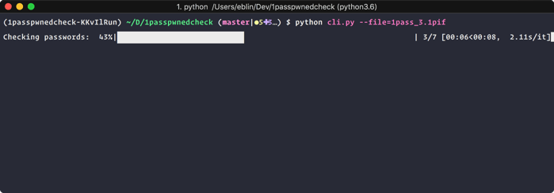
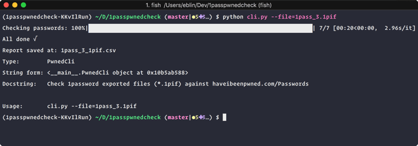
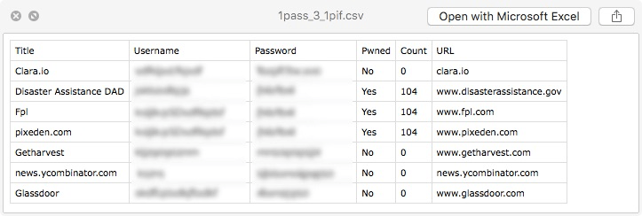

# 1passpwnedcheck

Check your 1password exported passwords (`.1pif` files) against [https://haveibeenpwned.com/Passwords](https://haveibeenpwned.com/Passwords) in bulk using using a [k-Anonymity model](https://haveibeenpwned.com/API/v2#SearchingPwnedPasswordsByRange). 

This means your passwords are never sent to the API only the first 5 characters of a SHA-1 password hash. [Read more](https://haveibeenpwned.com/API/v2#SearchingPwnedPasswordsByRange)

### Prerequisites
Make sure you have the following installed

- Python 3
- [pipenv](https://docs.pipenv.org/)
- 1password .1pif exported file.

#### Export your 1password items
You can either export only login items OR all items up to you.

```File > Export > All Items``` OR ```File > Export > Selected Items```

Make sure you select `1Password Interchange Format (.1pif)` as your file format.

**Remember this file is not encrypted so make sure you securely delete it afterwards**


### Running / Checking your passwords

1. Clone / Download the repo
2. Install dependencies `pipenv install`
    - After installation is done run: `pipenv shell`
3. Run the following command

```
python cli.py --file=path/to/your/passwords.1pif
```

Now just wait for script to finish and check the `.csv` report generated  at the end to see how many passwords you need to go change!

**The csv file generated is not encrypted and contains your passwords so make sure you securely delete it afterwards!**






## Credits
- [Troy Hunt](https://twitter.com/troyhunt) for the awesometastic service / api
- [1password](https://twitter.com/1password) for the also awesome app!